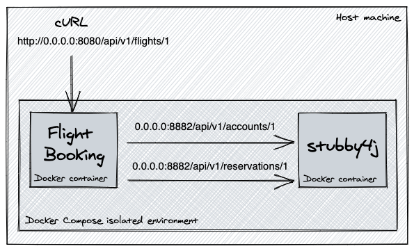

# Testing Microservices in Docker and Docker Compose

Testing Microservices using Docker (Docker Compose) with stubby4j, an HTTP stub server.

## Overview

The current repository contains the code which accompanies the [tutorial] (TBD Testing Microservices in Docker and Docker Compose) blog post. The tutorial talks about testing microservice interactions in local environment where we are stubbing some of these microservices in stubby4j. 

Docker Compose is a tool for defining and running multi-container Docker applications. With Compose, you use a YAML file to configure your application’s services. Then, with a single command, you create and start all the services from your configuration.

**stubby4j** is a tool for stubbing external systems in both Docker and non-containerized environments for integration, contract and behavior testing. stubby4j allows you to configure (i.e.: to stub) various failure/success scenarios with simple HTTP responses, as well as complex HTTP responses. See [stubby4j key features](https://github.com/azagniotov/stubby4j#key-features) for more information.

## Introduction

When developing and testing microservices, it is good practice to focus on testing interactions of the service with its direct upstream/downstream dependencies.

A few examples here can be:

* Testing that a service makes requests with expected headers and/or parameters,
* Testing that the service exposes the right endpoints,
* Testing that the service handles success/failure responses as expected and knows how to gracefully handle unexpected failures; or 
* Testing that the service interacts properly with external APIs.


In order to perform such tests, you would have to fake your indirect dependencies. Faking your dependencies can be easily achieved with [stubby4j](https://github.com/azagniotov/stubby4j). It helps to address the use cases outlined below (this is by no means an exhaustive list).
                                                                                                                                                                                                                                                                                                                                                                                                                                                                                                                                                                                                                                                                                                                                                                        
* Simulate responses from a real server and don't care (or cannot) to send requests over the network
* Stub out external web services (when developing & testing locally) in a Docker based micro-service architecture
* Avoid negative productivity impact when an external API you depend on doesn't exist or isn't complete
* Simulate edge cases and/or failure modes for your web service that the real remote API won't reliably produce
* Inject faults, where after X good responses on the same URI your web service gets a bad one
* Verify that your code makes HTTP requests with all the required parameters and/or headers
* Verify that your code correctly handles HTTP response error codes                                                                                                                                                                                                                                                                                                                                                                                                                                                                                                                                                                                                                                                                                                                                                                        

In this tutorial we will learn how to test microservices running in Docker environment by leveraging the Docker Compose and dependency stubbing with `stubby4j`.

## Approach

We use docker compose to spin up two local containers in an isolated environment using the definitions in the local [docker-compose.yaml](docker-compose.yaml):

1. `Flight Booking` web service (starts on `0.0.0.0:8080`). A REST-ful web service that fetches some information about a fake flight booking which consists from fake user account and fake user reservation information. The service exposes a single endpoint `/api/v1/flights/1` and relies on two downstream web services for the `Account` and `Reservation` information.

    _Please note that `Account` and `Reservation` services do not exist. The idea here is to assume that they are still being developed and thus need to be stubbed for our local testing in the meanwhile._

2. `stubby4j`, an HTTP stub server (starts on `0.0.0.0:8882`). The endpoints of the two web services `Account` and `Reservation` that `Flight Booking` consumes are stubbed in stubby4j.




The main idea behind the current exercise is to test the behavior of the `Flight Booking` service when the `/api/v1/flights/1` API is invoked and its downstream dependencies (i.e.: the stubbed `Account` and `Reservation` services) produce the following HTTP response codes:

| Use-case # | Account service   | Reservation service                                               |
|------------|-------------------|-------------------------------------------------------------------|
| 1          | `200 OK`          | `200 OK`                                                          |
| 2          | `200 OK`          | `400 Bad Request`                                                 |
| 3          | `200 OK`          | `403 Forbidden`                                                   |
| 4          | `200 OK`          | `500 Internal Server Error`                                       |
| 5          | `200 OK`          | `200 OK` (after 1500 millis to trigger socket read timeout) __*__ |

###### * The `Flight Booking` service HTTP client's socket read timeout is set to 1,000 milliseconds.

## Stubbing dependencies

`stubby4j` stubs defined in the following YAML config [stubby4j-yaml-config/stubs.yaml](stubby4j-yaml-config/stubs.yaml). The `Account` service stub is defined in [stubby4j-yaml-config/include-account-service-stubs.yaml](stubby4j-yaml-config/include-account-service-stubs.yaml), while the `Reservation` service stub is defined in [stubby4j-yaml-config/include-reservation-service-stubs.yaml](stubby4j-yaml-config/include-reservation-service-stubs.yaml)

When creating stub definitions, you can start by crafting a simple HTTP response by hand inside the YAML config. Unfortunately this method of stubbing makes it harder to define realistic responses and probably won’t scale as your project grows.

If you have a dump of a realistic HTTP response from a real blackened in a local file, `stubby4j` can load it via the `file` YAML property are runtime, i.e.: [stubby4j-yaml-config/include-reservation-service-stubs.yaml](stubby4j-yaml-config/include-reservation-service-stubs.yaml)

Alternatively, you can use [Record & Replay](https://github.com/azagniotov/stubby4j#record-and-replay) or [Request proxying](https://github.com/azagniotov/stubby4j#request-proxying) `stubby4j` features to record an HTTP response from a real backend for automatic replaying. This method of stubbing can scale better with your project development lifecycle.

To understand in more about the `stubby4j` configuration beyond this tutorial, see the [Endpoint configuration HOWTO](https://github.com/azagniotov/stubby4j#endpoint-configuration-howto) for more information.

## Building & Running

### Building 

From root folder with stubby4j configuration run `$ docker-compose up`. In another terminal you can query the logs from the command line or if running a Docker for Desktop GUI, you can select the logs from an active container.

#### Explanation

The command builds the `Flight Booking` image using the local [Dockerfile](Dockerfile) (this can take a few minutes, please be patient) and fetches pre-built `stubby4j` Docker image from [https://hub.docker.com/r/azagniotov/stubby4j](https://hub.docker.com/r/azagniotov/stubby4j)
 
### Running

Make a cURL (or in Postman / web browser) request:

`$ curl -X GET "http://localhost:8080/api/v1/flights/1"`

##### IMPORTANT: Docker on MacOS Caveats

If your cURL requests to `http://localhost:8080/api/v1/flights/1` fails with Connection refused, it means that the mapping of host machine port `8080` to the Docker container port `8080` did not work. You may need to setup port forwarding for port `8080` in `VirtualBox`: `Settings` => `Network` => `Adapter 1 (NAT)` => `Advanced` => `Port Forwarding`.

#### Flight Booking service responses

* `Flight Booking` responds with `200 OK` & the following JSON response (use-case #1):

    ```json
    {
      "reservation" : "p5e20A9hSi2IsV0soVpafQ==",
      "name" : "Leanne Graham",
      "phone" : "1-770-736-8031 x56442",
      "basePrice" : "USD10.00",
      "taxes" : "EUR19.62"
    }
    ```
* `Flight Booking` responds with `500 Internal Server Error` & the following JSON response (use-case #2):

    ```json
    {"code": 500, "message": "Server.ValidationException"}
    ```

* `Flight Booking` responds with `500 Internal Server Error` & the following JSON response (use-case #3):

    ```json
    {"code": 500, "message": "null"}
    ```


* `Flight Booking` responds with `500 Internal Server Error` & the following JSON response (use-case #4):

    ```json
    {"code": 500, "message": "Internal Server Error"}
    ```

* `Flight Booking` responds with `500 Internal Server Error` & generic Tomcat error due to socket read timeout (use-case #5)

    This is an example of a use case which `Flight Booking` service does not handle gracefully - request read timeout.

#### Explanation

Upon a `GET` request to the aforementioned `http://localhost:8080/api/v1/flights/1` the following data is returned from the two stubbed `Account` and `Reservation` services:

* The `Account` service endpoint `/api/v1/accounts/1` always responds with the HTTP status `200 OK` and the same HTTP JSON response defined in [stubby4j-yaml-config/json/account.service.expected.success.response.json](stubby4j-yaml-config/json/account.service.expected.success.response.json)
* The `Reservation` service endpoint `/api/v1/reservations/1` responds with different HTTP responses on each invocation of `http://localhost:8080/api/v1/flights/1` . There are a total of five different HTTP responses that `stubby4j` loops over when rendering responses for `/api/v1/reservations/1`: `200 OK`, `400 Bad Request`, `403 Forbidden` and two `500 Internal Server Error` with different JSON response bodies defined under [stubby4j-yaml-config/json](stubby4j-yaml-config/json).

### Logs

At runtime, the `stubby4j` application logs are emitted into `stubby4j-yaml-config/logs/stubby4j.log`. The logs contain debug information from matching incoming HTTP requests to the defined stubs.


## Conclusion

In this tutorial, we've learnt how to test microservices locally running in a Docker environment by leveraging Docker Compose and `stubby4j`, an HTTP stub server.

We also saw how to stub multiple HTTP responses with different behavior under the same stubbed URI defined in defined in [stubby4j-yaml-config/include-reservation-service-stubs.yaml](stubby4j-yaml-config/include-reservation-service-stubs.yaml).

To understand in more depth the `stubby4j` capabilities and the available features, see [https://github.com/azagniotov/stubby4j](https://github.com/azagniotov/stubby4j) and [Endpoint configuration HOWTO](https://github.com/azagniotov/stubby4j#endpoint-configuration-howto) for more information.

The source code for this tutorial is available over on [GitHub](https://github.com/azagniotov/testing-microservices-in-docker-and-docker-compose)

## License
MIT. See [LICENSE](https://github.com/azagniotov/testing-microservices-in-docker-and-docker-compose/blob/master/LICENSE) for details.
 
